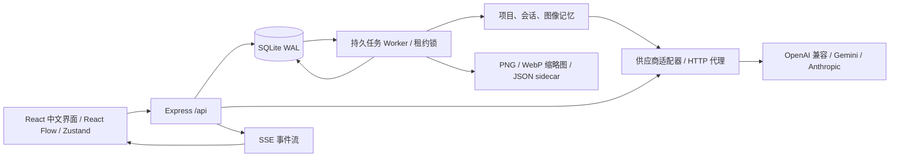

# 拾光 · AI 图像生成工作台

[](LICENSE)

同一轮提示词保留一个节点，每张图片独立连线。从图片点击「修改这张图」即可生成新分支，保留原图和创作路径。

代码采用 [MIT License](LICENSE)。欢迎提交 Issue 或 Pull Request；提交前运行 `npm test` 和 `npm run build`。请勿附带真实 Key、设备凭证、数据库或私人图片。

本仓库仅包含源码与配置示例，不包含 API Key、用户图片、数据库或日志。当前版本面向本地或可信内网，Key 明文存于服务端 SQLite，尚无账号系统，不适合直接暴露到公共互联网。

一个可本地运行的中文图像工作台。浏览器只访问自己的后端；Key、任务、项目、记忆和费用保存在 SQLite，图片保存在后端指定目录。界面采用暖纸色、陶土色和宋体标题，适配桌面与手机。

## 快速启动

需要 Node.js **22.13 或更新版本**；已在 Windows / Node 22.23.1 验证。使用内置 `node:sqlite`，无需安装数据库服务；Node 22 可能提示 SQLite 仍是实验功能。

```powershell
git clone https://github.com/tianyin231/shiguang.git
cd shiguang
npm ci
Copy-Item .env.example .env
npm run dev
```

打开 **http://127.0.0.1:4327**。已有 `.env` 时保留自己的设置。端口冲突可修改 `PORT`。

1. 在「连接设置」填写供应商名称、Base URL、API Key 和接口类型。点击「发现模型」，勾选所需模型后保存；也可直接保存连接，稍后手动添加模型。
2. 在「模型管理」确认能力、尺寸、质量、单价。模型名推断仅作为初始标记，不代表 Key 已验证有权限。主动探测需点击费用确认。
3. 在画布输入提示词，设置每个组合张数、并发和预算，开始生成。更多选项支持 seed、提示词变体及尺寸/质量组合。
4. 从任意图片选择「作为参考图继续创作」，上传原图走图生图；具备 mask 能力时可以画遮罩。能力不足时明确提示，只有手动允许后才用元数据文生图降级。
5. 设置目录后，新图片写入新目录；原图仍从原路径访问。刷新与重开同一浏览器会恢复供应商、项目、任务和画布，无需重填 Key。

「试用演示」默认在本地用代码生成固定几何占位图，只用于体验队列和界面。它不调用模型，不会按提示词改变图片，也不能用来判断真实图生图效果。可自行放入 `public/samples/workshop.png` 作为私有样例，该目录不会提交。真实供应商需自行填入连接。本项目不预置 API Key 或用户图片。

## 架构与文件



采用 **React + TypeScript + Vite / Express / Node SQLite**，以便单个进程即可启动，并能把 worker 拆出。React Flow 提供无限画布，Zustand 管理前端状态，Sharp 处理存储图片。没有依赖 Redis、Prisma、外部字体或向量服务。

```text
image-workbench/
├─ src/
│  ├─ App.tsx             导航、设备初始化、SSE 状态同步
│  ├─ CanvasPage.tsx      节点、父子关系、编辑历史与版本
│  ├─ Composer.tsx        并发参数、参考图、遮罩与追问
│  ├─ Pages.tsx           设置、模型、任务、图库、成本、记忆
│  ├─ components.tsx      共用控件、图片操作与详情
│  ├─ api.ts / store.ts   请求与应用状态
│  └─ styles.css          暖色视觉与移动端布局
├─ server/
│  ├─ app.ts              API、配置、代理、SSE、费用
│  ├─ db.ts               SQLite 表与事务
│  ├─ queue.ts            任务预估、持久队列、worker、重试
│  ├─ providers.ts        供应商协议适配与网络请求
│  ├─ storage.ts          原图、缩略图、sidecar、去重与配额
│  ├─ memory.ts           记忆筛选与实际提示词组装
│  ├─ validation.ts       Zod 请求校验
│  ├─ index.ts            HTTP / 开发服务入口
│  └─ worker-entry.ts     独立 worker 入口
├─ shared/types.ts        前后端数据契约
├─ tests/workbench.test.ts 本地模拟供应商的集成测试
├─ public/icon.svg        应用图标（无用户图片）
├─ data/                  自动创建的数据库目录
├─ outputs/               默认图片输出目录
├─ .env.example
├─ Dockerfile / compose.yaml
└─ README.md
```

### 数据模型

常规实体的业务字段放在 JSON `data` 中；关系和调度条件另设列并建立索引。类型定义以 `shared/types.ts` 为准。

| 表 | 核心内容 |
| --- | --- |
| devices | 设备 ID、唯一 token、激活供应商、设置、最近访问时间 |
| providers | 设备归属、名称、Base URL、明文 Key、适配器、HTTP 代理、并发与冷却状态 |
| models | 供应商归属、能力、验证结果、尺寸、质量、seed/n、并发、收藏、默认项、价格表 |
| projects | 名称、完整画布、revision、创建时间 |
| sessions | 项目归属、消息、摘要 |
| tasks | 项目/供应商/模型/批次、状态、优先级、执行时间、owner、租约、取消位、提示词、价格快照、费用、父图 |
| images | 项目、父图、任务、文件路径、SHA-256、尺寸、提示词、参数、费用、评分与收藏 |
| memories | 项目、会话或图像范围、正文、启用状态 |
| versions | 项目、快照名、创建时间、画布快照 |
| events | 设备范围的持久 SSE 事件与递增 ID |
| requests | 设备 + idempotencyKey，避免重复提交批次 |
| charges | 对话、探测、原始代理及中断请求的费用，分别标记 provider / estimate |
| proxy_leases | 原始代理请求并发租约，与生成队列共用供应商并发额度 |

### 实现阶段与验证

| 阶段 | 可运行的交付 | 测试方式 |
| --- | --- | --- |
| 1 · 连接 | 后端 Key 持久化、多供应商、模型发现与手动配置 | 保存两个供应商、切换、刷新；集成测试检查 Cookie / Bearer 恢复与本地网关 |
| 2 · 生成 | 持久队列、并发、预算、代理、取消与 SSE | 一次生成多张，刷新任务页；测试双 worker、429、死信、过期租约与预算拒绝 |
| 3 · 文件 | PNG、缩略图、sidecar、图库与对比 | 检查输出目录与 JSON；测试图片下载、去重、实际成本、参考图与遮罩 multipart |
| 4 · 画布 | 拖拽、缩放、连线、分组、复制、撤销/重做、父子关系、版本与分支 | 从图片迭代，检查连线；切页/刷新后恢复，导出再导入；接口测试版本冲突 |
| 5 · 记忆 | 三层记忆、视觉追问、降级提示、上下文压缩 | 添加固定角色设定后生成，任务详情查看最终提示词；测试视觉图像负载与缓存隔离 |
| 6 · 部署 | 生产构建、环境变量、Docker 与 API 文档 | `npm test`、`npm run build`、`npm start`，检查 `/api/health` |

```powershell
npm test
npm run check
npm run build
npm start
```

自动测试使用临时数据库、临时图片目录和本地 HTTP 模拟接口，不会读取真实 Key 或产生外部费用。测试覆盖模型预览与选择保存、画布迁移、持久任务等场景，包含 OpenAI 兼容、Gemini 与 Anthropic 协议，以及跨供应商批次并发。它验证真实 HTTP、multipart 与 SSE 数据传输，但不证明某个外部供应商或 Key 的权限和模型效果。Docker 配置需在具有 Docker 的环境中构建验证。

## 环境变量与生产部署

| 变量 | 默认值 | 说明 |
| --- | --- | --- |
| PORT | 4327 | HTTP 端口 |
| HOST | 127.0.0.1 | 本地监听；容器或局域网部署用 0.0.0.0 |
| DATA_DIR | ./data | SQLite 数据库及 WAL 所在目录 |
| OUTPUT_DIR | ./outputs | 新设备默认输出目录，之后可在 UI 修改 |
| WORKER_ENABLED | true | HTTP 进程是否同时运行 worker |
| WORKER_CONCURRENCY | 6 | 每个 worker 最大执行槽数；还会受供应商、模型和批次限制 |
| COOKIE_SECURE | false | HTTPS 部署可设 true |
| NODE_ENV | 非 production | `npm start` 自动采用生产静态文件；也可显式设 production |

普通部署：运行 `npm ci`、`npm run build`、`npm start`。保持工作目录为项目根目录；用系统服务或进程管理器常驻。更新代码后重新构建，保留 `data` 和输出目录。

Docker：

```sh
docker compose up -d --build
docker compose logs -f workbench
```

默认使用命名卷 `workbench-data` 和 `workbench-images`；容器里输出目录为 `/app/outputs`。若需要在宿主机直接查看，可把图片卷改成 `./outputs:/app/outputs`，并确保容器用户可写。UI 中设置的目录必须在持久卷中，否则重建容器会丢文件。容器访问宿主机网关时，Docker Desktop 通常使用 `host.docker.internal`；容器里的 localhost 指容器自身。

拆分 worker：HTTP 进程设置 `WORKER_ENABLED=false` 后 `npm start`；另开终端使用相同绝对 `DATA_DIR`、`OUTPUT_DIR` 和工作目录运行 `npm run worker`。多个 worker 必须共享同一台机器上的 SQLite 和图片目录，使用事务领取任务及 30 秒租约，1 秒续约。此部署方式不适合无持久盘的 serverless 环境，也不支持把 SQLite 分散到多台主机。

Nginx 反向代理示例（放到现有 server 配置中）：

```nginx
location / {
    proxy_pass http://127.0.0.1:4327;
    proxy_http_version 1.1;
    proxy_buffering off;
    proxy_read_timeout 1800s;
    client_max_body_size 64m;
    proxy_set_header Host $host;
    proxy_set_header X-Forwarded-Proto $scheme;
}
```

前后端同源，浏览器不访问供应商，因此不需要供应商允许浏览器 CORS。开发端口同时提供 UI 与 API；不要直接把浏览器请求改到供应商域名。

## 任务、文件与费用行为

- 组合数 = 模型数 × 提示词变体数 × 尺寸数 × 质量数 × 每组张数；单批最多 128 个任务。填写变体时，每行完整提示词替代主提示词。
- 每任务向供应商请求一张。启用 `supportsN` 才发送 `n=1`，启用 `supportsSeed` 才发送 seed；尺寸与质量最终由供应商验证。
- 提交先事务落库，再由 worker 领取；前端断开不影响任务。排队、执行中、完成、失败、取消、死信均可恢复。429 会降低该供应商并发并冷却；网络失败和 5xx 按指数退避重试。
- 本地批次提交幂等，租约避免正常执行时重复领取；上游请求携带 Idempotency-Key。供应商是否真正支持此请求头无法由本地保证，进程崩溃或网络中断仍可能重复计费。中断费用保守保留，后续重试不会把它覆盖掉。
- 单次、批次及各币种总预算在提交时检查；排队任务预占费用，执行前再次检查。成本超出估算会熔断后续任务，但不能撤回供应商已经发生的扣费。没有价格时显示零价警告，需先补充价格才能得到有意义的预算。
- 单价支持按张、百万像素、百万 token，以及质量倍率。只有供应商返回非负 `actual_cost` / `cost` / `usage.cost` 才标为实际费用；token 数量乘自定义单价仍标为估算。所有供应商金额按模型配置币种解释，不进行汇率换算。
- 默认文件模板：`{date}/{model}/{prompt_hash}/{seed}-{id}.png`。没有 `{id}` 时自动加入 ID，避免同 seed 覆盖。日期按 UTC；图片统一 PNG，缩略图为 WebP。
- 每条图片资产有独立 sidecar，记录原提示词、注入后的最终提示词、模型、参数、seed、费用来源、父图、会话、SHA、路径、评分。相同像素数据共用原图，保留独立资产、缩略图及 sidecar。
- 配额按每条资产声明的 PNG 字节数累计，属于保守逻辑配额，非整个目录精确磁盘占用。图库清理只删除当前项目已淘汰资源，会跳过活动任务引用及被其他资产共用的原图。
- 画布自动保存约 700ms，切页立即提交；显示“已保存”后再关闭浏览器最稳妥。多个窗口冲突返回 409，不静默覆盖。撤销/重做是当前页面最多 40 步历史；跨刷新请保存版本快照。
- JSON 导出含画布、记忆和图片元数据，不内嵌图片二进制。跨设备导入缺失图片显示占位；迁移完整项目需同时迁移数据库与图片目录，保持记录中的绝对路径可访问。
- 记忆使用本地中文分词匹配和范围过滤，选取最多 12 条；组装上下文最多约 7000 字符，原始本次要求置于末尾优先。会话压缩为保留末尾 5000 字符的本地摘要，不调用收费模型。

本版本采用设备凭证而非账号：90 天 HttpOnly Cookie + localStorage token，SQLite 明文存 Key。主动退出会清除本地凭证并使旧 token 失效，数据库文件保留；无账号恢复或跨设备自动登录。多人协作、只读分享、向量数据库、浏览器目录授权、ControlNet / LoRA / 扩图 / 放大等可选扩展未实现。

## API 文档

所有业务路径以 `/api` 开头。除 `/health` 和首次 `/config` 外，需要 Cookie `workbench_device` 或请求头 `Authorization: Bearer <deviceToken>`。这里的 Bearer 是工作台设备凭证，**不是供应商 Key**。错误格式为 `{ "error": "说明" }`；主要状态码：400 参数或能力错误，401 设备失效，402 预算不足，404 不存在，409 版本冲突，413 文件或配额限制，429 并发限制。

### 路由总表

| 方法与路径 | 请求与返回 |
| --- | --- |
| GET /health | `{ok:true}` |
| GET /config | 首次创建设备；返回 deviceToken、供应商列表、激活项和 settings；列表不返回 apiKey |
| POST /config | `{id?,name?,baseUrl,apiKey?,adapter?,proxyUrl?,concurrency?}`；名称留空使用主机名，id 更新现有项，Key 留空保留；返回配置 |
| POST /config/active | `{providerId}`；切换当前供应商 |
| PUT /settings | 完整 Settings：outputDir、filenameTemplate、quotaMB、totalBudgets、concurrency、retries、timeout |
| POST /logout | 清除 Cookie，轮换旧设备 token |
| GET /state | models、projects、sessions、tasks、images、memories 状态快照 |
| GET /models?providerId= | 已保存模型 |
| POST /models/preview | 供应商草稿配置 → `{names}`，不保存供应商或模型 |
| POST /models/discover | `{providerId?}`；自动发现并合并模型，保留手工配置 |
| POST /models | `{providerId?,name,...模型配置}`；手动创建 |
| PATCH /models/:id | 更新 capabilities、sizes、qualities、supportsSeed、supportsN、maxConcurrency、favorite、isDefault、price 等 |
| POST /models/:id/probe | `{capability,confirmCost:true,projectId?,sessionId?,referenceId?,refresh?}`；图像探测进入队列，对话/视觉直接返回；24 小时缓存，refresh 跳过缓存 |
| POST /projects | `{name}` → `{project,session}` |
| PUT /projects/:id/canvas | `{revision,canvas}` → 更新后的项目；revision 不一致返回 409 |
| GET /projects/:id/export | 项目 JSON，schemaVersion=1 |
| POST /projects/import | 导出的 JSON → 新项目与会话；同设备分支可复用已有图像 ID |
| GET /projects/:id/versions | 画布版本列表 |
| POST /projects/:id/versions | `{name?}` 保存当前画布快照 |
| POST /projects/:id/restore/:version | 恢复快照，revision 加一 |
| POST /sessions | `{projectId,title?}` 新建会话 |
| POST /sessions/:id/compress | 本地压缩消息，返回会话 |
| DELETE /sessions/:id/context | 清空消息和摘要 |
| POST /chat | `{modelId,sessionId,message,imageId?}` → `{text,vision,fallback,cost,currency,session}` |
| GET /memories | 当前设备全部显式记忆 |
| POST /memories | `{id?,projectId,scope,content,sessionId?,imageId?,enabled?}`；scope 为 project/session/image |
| DELETE /memories/:id | 删除一条记忆 |
| POST /tasks/estimate | GenerateInput → `{count,totals,warnings,items}`，不提交、不收费 |
| POST /tasks | GenerateInput → Task[]，202；idempotencyKey 相同返回同一批任务 |
| GET /tasks | 持久任务列表（包含日志、最终提示词、费用） |
| POST /tasks/:id/cancel | 请求取消，运行中任务会终止网络连接 |
| POST /tasks/:id/retry | 失败、死信或已取消任务重新入队，再检查预算 |
| PATCH /tasks/:id | `{priority:0..10}` |
| GET /events | SSE：ready、task、images、models；支持 Last-Event-ID / ?after= |
| POST /images/upload | multipart：image 文件、projectId、sessionId、prompt? → ImageAsset |
| GET /images | 图片资产列表 |
| GET /images/:id/file?download=1 | 原图；download 可选 |
| GET /images/:id/thumbnail | WebP 缩略图 |
| PATCH /images/:id | `{rating?:0..5,favorite?,discarded?}`，同步 sidecar |
| POST /images/gc | `{projectId?}` 清理已淘汰资源；省略则针对本设备所有项目 |
| GET /costs | 各币种 totals、tasks、charges；settled 含估算，reserved 为预占 |
| GET /costs/export | 带 UTF-8 BOM 的 CSV |
| POST /demo | 启用固定图片的免费本地演示 |

### 可复制的请求示例

PowerShell 示例：先启动应用，以下操作使用一个独立设备会话。

```powershell
$root = 'http://127.0.0.1:4327/api'
$config = Invoke-RestMethod "$root/config"
$auth = @{ Authorization = "Bearer $($config.deviceToken)" }
$connection = @{
  name = '本地网关'
  baseUrl = 'http://127.0.0.1:3000/v1'
  apiKey = '在此填写自己的 Key'
  adapter = 'openai'
  concurrency = 4
} | ConvertTo-Json
$config = Invoke-RestMethod "$root/config" -Method Post -Headers $auth -ContentType 'application/json' -Body $connection
Invoke-RestMethod "$root/models/discover" -Method Post -Headers $auth -ContentType 'application/json' -Body '{}'
$state = Invoke-RestMethod "$root/state" -Headers $auth
```

GenerateInput 完整示例（从 `/state` 取得实际 ID）：

```json
{
  "projectId": "实际项目ID",
  "sessionId": "实际会话ID",
  "modelIds": ["工作台模型记录ID"],
  "prompt": "暖木工坊，柔和阳光，清晰大色块，无文字",
  "variants": [],
  "count": 4,
  "sizes": ["1024x1024"],
  "qualities": ["auto"],
  "seed": 1234,
  "concurrency": 2,
  "retries": 1,
  "timeout": 600,
  "priority": 0,
  "taskBudget": 1,
  "batchBudget": 4,
  "allowFallback": false,
  "idempotencyKey": "为这次批次生成一个唯一ID"
}
```

`referenceId` / `maskId` 是 `/images/upload` 或图库返回的资产 ID，可选。本地文件路径不直接发给模型；服务端读取实际图片，OpenAI 兼容 edits 使用 multipart 二进制，Gemini 使用 inlineData。任务及 sidecar 的 `effectivePrompt` 可验证实际发送内容，`parentImageId` / `parentId` 可追溯迭代来源。

价格示例：

```json
{
  "capabilities": ["text2image", "image2image", "mask"],
  "supportsN": true,
  "supportsSeed": false,
  "maxConcurrency": 4,
  "price": {
    "type": "image",
    "unit": 0.04,
    "outputUnit": 0,
    "currency": "USD",
    "qualityMultiplier": {"low": 0.5, "medium": 1, "high": 2}
  }
}
```

上面价格只是字段示例，不代表任何模型的市场报价。

SSE 事件示例：

```text
id: 123
event: task
data: {"id":"任务ID","status":"running","attempts":1}

```

实际 task 事件包含完整 Task。前端收到事件会合并刷新状态；断线后 EventSource 自动重连，数据库事件 ID 可补读。

### 原始代理接口

支持 `GET /api/proxy/models`，以及 `POST /api/proxy/images/generations`、`images/edits`、`chat/completions`。默认转发到激活供应商，可用 `X-Provider-Id` 指定其他已保存项。超时 10 分钟，客户端断开会取消连接；429/5xx 最多三次尝试。

JSON 模型字段使用供应商模型名，不是数据库 ID；必须先在模型管理注册它，才能套用价格并预占预算。edits 原样保留 multipart 图片和遮罩。原始代理不创建画布节点或保存图片，应用内创作应使用 `/api/tasks`。

```json
{
  "model": "供应商实际模型名",
  "messages": [{"role": "user", "content": "帮我改写成暖色游戏封面提示词"}],
  "max_tokens": 512,
  "stream": true
}
```

OpenAI 兼容端点返回原始流；Gemini / Anthropic 对话请求会适配，但响应及 SSE 保留供应商原生格式，响应头 `X-Provider-Format` 告知适配器。需要统一文本结果时使用 `/api/chat`。原生供应商图像接口使用 `/api/tasks`，不走 OpenAI images 原始代理。

适配器支持范围：

| 类型 | 图像 | 对话 / 视觉 | 说明 |
| --- | --- | --- | --- |
| openai | generations + multipart edits / mask | chat/completions + image_url | 同时用于第三方兼容服务、one-api、本地网关 |
| gemini | generateContent + inlineData，解析返回图片 | generateContent / streamGenerateContent | 仅适配原生内容生成协议；需选择支持生成图片的模型，不含独立 Imagen predict 协议或 mask |
| anthropic | 不提供图像生成 | messages + base64 image，支持原生 SSE | 可用于视觉理解与改写，再交给图像模型生成 |
| demo | 固定本地 PNG | 本地模板回复 | 不验证外部模型能力，不产生费用 |

Base URL 如末尾已有 `/v1` 或 `/v1beta` 会直接使用；其他 OpenAI 兼容地址自动追加 `/v1`，Gemini 自动追加 `/v1beta`。代理只支持 HTTP(S) 地址。模型支持、参数、配额与实际收费均由供应商决定，错误会进入任务详情并保留日志。
